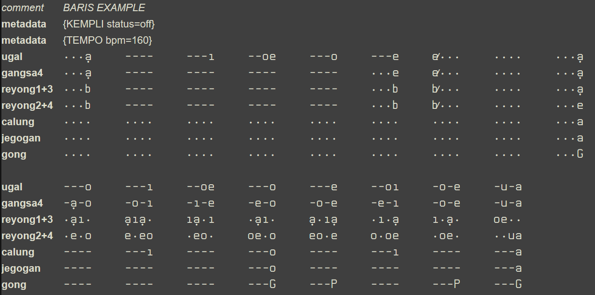

# Gamelan Notation
This application creates MIDI files from the notation of Balinese gamelan.

## Installation
This project uses pyenv-win and pyenv-win-venv for Windows
See https://pyenv-win.github.io/pyenv-win/ and https://github.com/pyenv-win/pyenv-win-venv

To install a python version (if not available yet):
```
    venv install <python version>
```

To create and activate an environment:

```
pyenv-venv install <python version> <environment name>
pyenv-venv activate <environment name>
```
Install Poetry, see https://python-poetry.org/docs/. Then install dependencies with the command:
```
poetry install
```

## Notation file conventions
### Encoding
Be sure to save the tsv files as UTF-8 encoded (many text editors such as TextPad let the user select this option when saving a file). Other formats might give problems parsing some specific UTF-coded characters.

### General syntax
- Each row should either be empty (except for tab characters) or have the following structure:
  ```
    <tag>\t<content>
  ```
  where \t stands for a tab character.
- `<tag>` can have the following values:
    - The name of an instrument position (see below) - indicates that `<content>` contains notation for the given position.
    - `comment` - the `<content>` part of the line will be ignored.
    - `metadata` - indicates that `<content>` contains information about tempo, sequence of execution (labels and `GOTO` statements), dynamics, etc. See below for a more detailed explanation.

Here is an example of the beginning of the Baris notation (omitting several instruments for simplicity):




## Bali Music TTF font
The above notation is displayed using the BaliMusic5 TrueType font. This font was created for the notation of Balinese (gong kebyar) music. With a regular monospaced font the same content would look like this:


```
comment     BARIS EXAMPLE
metadata    {KEMPLI status=off}                                
metadata    {TEMPO bpm=160}                                
ugal        ...a,    ----     ---i     --oe     ---o     ---e     e/...    ....    ...a,
gangsa4     ...a,    ----     ----     ----     ----     ...e     e/...    ....    ...a,
reyong1+3   ...b     ----     ----     ----     ----     ...b     b/...    ....    ...a,
reyong2+4   ...b     ----     ----     ----     ----     ...b     b/...    ....    ...e
calung      ....     ....     ....     ....     ....     ....     ....     ....    ...a
jegogan     ....     ....     ....     ....     ....     ....     ....     ....    ...a
gong        ....     ....     ....     ....     ....     ....     ....     ....    ...G
    
ugal        ---o     ---i     --oe     ---o     ---e     --oi     -o-e     -u-a
gangsa4     -a,-o    -o-i     -i-e     -e-o     -o-e     -e-i     -o-e     -u-a
reyong1+3   .a,i.    a,ia,.   ia,.i    .a,i.    a,.ia,   .i.a,    i.a,.    oe..
reyong2+4   .e.o     e.eo     .eo.     oe.o     eo.e     o.oe     .oe.     ..ua
calung      ----     ---i     ----     ---o     ----     ---i     ----     ---a
jegogan     ----     ----     ----     ---o     ----     ----     ----     ---a
gong        ----     ----     ----     ---G     ---P     ----     ---P     ---G

```


### Metadata syntax


## Vocabulary
### Balinese Music
- `Muted`: key instruments: the key is muted with the left hand while striking it. Reyong: only used for `jet`.
- `Abbreviated`: key instruments: the key is muted shortly after being stricken. Reyong: only used for `byot`.
- `byot`: strike the gongs and then immediately mute them.
- `jet`: strike the gongs without lifting the panggul.

### MIDI files


### MIDI Soundfont files
- `SoundFont`: file which contains audio samples. The samples are organized in a hierachy: `bank` -> `preset` -> `zone` -> `split`
- `bank`: top level of the soundfont hierarchy. Banks are numbered 0..127.
- `preset`: second level of the soundfont hierarchy. Presets are numbered 0..127. Synonymns for preset are `instrument`, `patch` and `program`. A preset defines a unique mapping between audio samples and MIDI notes. A preset can be mapped to a MIDI channel which in turn can be mapped to a MIDI device such as a keyboard.
- `zone`: corresponds with a subset of the MIDI notes of a preset. There is always one zone called `Global`. Zones can be used to further split up the note range into logical groups, for instance in case a preset contains more than one instrument. Concretely this would mean that diffent ranges of a MIDI keyboard that is mapped to the preset would correspond with different instruments. Synonymns for zone are `layer` and `instrument` (note that a preset is sometimes also called an instrument).
- `split`: lowest level of the soundfont hierarchy. A split corresponds with a single audio sample which is mapped to a single MIDI note or to a range of MIDI notes. In the latter case, the `root key` of the split indicates the MIDI note that corresponds with the pitch of the audio sample. The other MIDI notes in the split correspond with a modulation of the audio sample. This modulation is performed by the synthesizer that is connected to the MIDI device (e.g. keyboard).

Zones and splits can contain parameters (usually called “generators”) that can alter the sound of the audio samples. E.g. Velocity Range, Attenuation, Volume envelopes for attack, sustain and decay. The zone parameters act as multiplicators for the corresponding split parameters. Presets can share zones and can each have a separate set of generator values for the same zone (instrument). So the same instrument may sound differently depending on which preset is selected.


